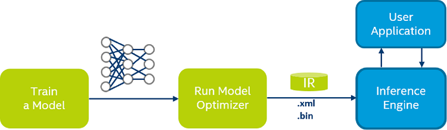
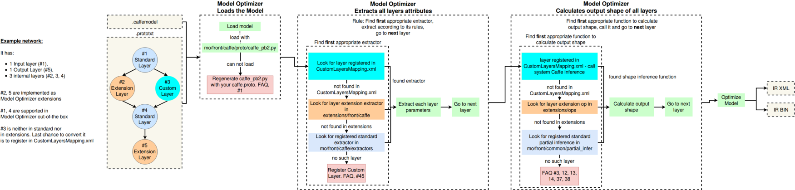

# Project Write-Up

You can use this document as a template for providing your project write-up. However, if you
have a different format you prefer, feel free to use it as long as you answer all required
questions.

## Explaining Custom Layers

### Model Optimizer
Model Optimizer is a cross-platform command-line tool that facilitates the transition between the training and deployment environment, performs static model analysis, and adjusts deep learning models for optimal execution on end-point target devices [1].

#### Converting a Model to Intermediate Representation (IR)
Model Optimizer produces an Intermediate Representation (IR) of the network, which can be read, loaded, and inferred with the Inference Engine [1].
The IR is a pair of files describing the model:
- .xml - Describes the network topology
- .bin - Contains the weights and biases binary data.


### Custom Layers
Model Optimizer searches for each layer of the input model in the list of known layers before building the model's internal representation, optimizing the model, and producing the Intermediate Representation. The list of known layers is different for each of supported frameworks [2].

Custom layers are neural network model layers that are not natively supported by a given model framework (not included into a list of known layers).

### The process behind converting custom layers involves:
1. The model is fed to the Model Optimizer.
2. Model Optimizer extracts the attributes of all layers.
3. Model Optimizer calculates the output shape of all layers.
4. Model Optimizer optimizes the original model and produces the IR.
Options to convert are based on framework (Caffe/TensorFlow/MXNet)
  - Caffe:
      - The second option is to register the layers as Custom, then use Caffe to calculate the output shape of the layer.
  - TensorFlow:
      - The second option is to actually replace the unsupported subgraph with a different subgraph.
      - The final option is to actually offload the computation of the subgraph back to TensorFlow during inference.

The general process is as shown:


### Some of the potential reasons for handling custom layers:
* Optimize the pre-trained models
* Speed up the output Performance
* Complex application requires some unique layers

## Comparing Model Performance

My method(s) to compare models before and after conversion to Intermediate Representations
were...

The difference between model accuracy pre- and post-conversion was...

The size of the model pre- and post-conversion was...

The inference time of the model pre- and post-conversion was...

## Assess Model Use Cases

Some of the potential use cases of the people counter app are...

Each of these use cases would be useful because...

## Assess Effects on End User Needs

Lighting, model accuracy, and camera focal length/image size have different effects on a
deployed edge model. The potential effects of each of these are as follows...

## Model Research

In investigating potential people counter models, I tried each of the following three models:

- Model 1: YOLO V3
  - [Model Source](https://pjreddie.com/darknet/yolo/)
  - I converted the model to an Intermediate Representation with the following arguments
  ```
  git clone https://github.com/pjreddie/darknet
  cd darknet
  make

  wget https://pjreddie.com/media/files/yolov3.weights

  python3 convert_weights_pb.py --class_names coco.names --data_format NHWC --weights_file yolov3.weights

  export MOD_OPT=/opt/intel/openvino/deployment_tools/model_optimizer

  python $MOD_OPT/mo_tf.py \
    --reverse_input_channels \
    --transformations_config=$MO_PATH/extensions/front/tf/yolo_v3.json \
    --input_model=frozen_darknet_yolov3_model.pb \
    --data_type=FP16 --batch 10
  ```

  - The model was insufficient for the app because it was very slow
  - I tried to improve the model for the app by decrease the accuracy but not was perfect.

- Model 2: [COCO SSD MobileNet v1]
  - [Model Source](https://storage.googleapis.com/download.tensorflow.org/models/tflite/coco_ssd_mobilenet_v1_1.0_quant_2018_06_29.zip)
  - I converted the model to an Intermediate Representation with the following arguments:

  ```
  wget https://storage.googleapis.com/download.tensorflow.org/models/tflite/coco_ssd_mobilenet_v1_1.0_quant_2018_06_29.zip
  sudo unzip  coco_ssd_mobilenet_v1_1.0_quant_2018_06_29.zip

  cd coco_ssd_mobilenet_v1_1.0_quant_2018_06_29

  export MOD_OPT=/opt/intel/openvino/deployment_tools/model_optimizer

  python $MOD_OPT/mo.py \
    --input_model frozen_inference_graph.pb \
    --tensorflow_object_detection_api_pipeline_config pipeline.config \
    --reverse_input_channels \
    --tensorflow_use_custom_operations_config $MOD_OPT/extensions/front/tf/ssd_v2_support.json
  ```
  - The model was insufficient for the app because failed to detect people
  - I tried to improve the model for the app by increase accuracy but not successful.

- Model 3: [COCO SSD MobileNet V2]
  - [Model Source](http://download.tensorflow.org/models/object_detection/ssd_mobilenet_v2_coco_2018_03_29.tar.gz)
  - I converted the model to an Intermediate Representation with the following arguments:
  ```
  wget http://download.tensorflow.org/models/object_detection/ssd_mobilenet_v2_coco_2018_03_29.tar.gz
  sudo tar -xvf ssd_mobilenet_v2_coco_2018_03_29.tar.gz

  cd ssd_mobilenet_v2_coco_2018_03_29

  export MOD_OPT=/opt/intel/openvino/deployment_tools/model_optimizer

  python $MOD_OPT/mo.py \
    --input_model frozen_inference_graph.pb \
    --tensorflow_object_detection_api_pipeline_config pipeline.config \
    --reverse_input_channels \
    --tensorflow_use_custom_operations_config $MOD_OPT/extensions/front/tf/ssd_v2_support.json
  ```
  - The model was insufficient for the app because failed to detect people
  - I tried to improve the model for the app by change accuracy but not successful.

# The Model
I also try models from the OpenVino Model:
- pedestrian-detection-adas-0002
- person-detection-retail-0013
The person-detection-retail-0013 was a higher overall accuracy but if increase the Probability threshold above 75%.
The script of use and run found at ```run.sh``` file.


# References
1. [Model Optimizer Developer Guide](https://docs.openvinotoolkit.org/latest/openvino_docs_MO_DG_Deep_Learning_Model_Optimizer_DevGuide.html)
2. [Custom Layers in the Model Optimizer](https://docs.openvinotoolkit.org/latest/openvino_docs_MO_DG_prepare_model_customize_model_optimizer_Customize_Model_Optimizer.html)
